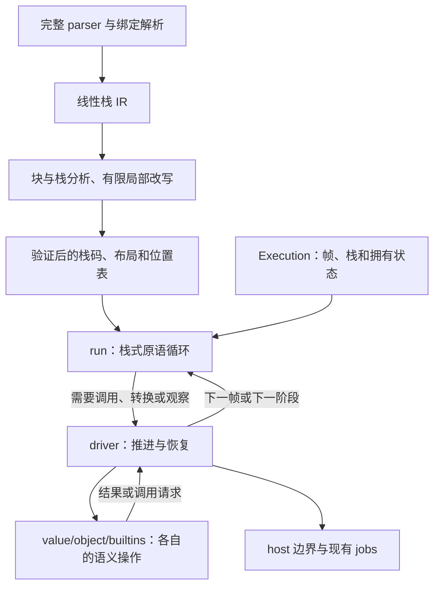

# 栈 VM 优化计划：执行架构与代码职责

状态：2026-09-15，已确定继续使用**栈虚拟机**。S01–S08 已验收，S09 与其 N1–N3 后续、新 S10–S12（惰性帧/窄状态机/属性读 IC）已实施；性能退出条件未全部通过，58 fixed 仍有 25 项高于 S0（见[联合报告](performance/README.md)）。残余差值的实现层根因与修复阶段见 [S14–S20 修复计划](primitive-vm-s14-s20-recovery-plan.md)；原退役旧路径阶段顺延为 S13。具体证据以[逐 commit 计划](primitive-vm-commit-plan.md)和迁移清单为准。

面向实现者和审查者。目标是在一个 PR 内改进执行架构，解决 issue #16 的栈深、数值执行、调用存储、局部更新与 PC 管理问题。算法和模块设计见[实施设计](primitive-vm-implementation-plan.md)，顺序见[逐 commit 计划](primitive-vm-commit-plan.md)，范围见[迁移清单](primitive-vm-migration.md)。

[架构说明](architecture.md)记录当前实现与跨模块职责；本文及上述三份文档共同定义本次改造。[历史计划](archive/README.md)保留旧基线，不为本轮追加目录、接口或执行方式的保留要求。

## 1. 已确定方向与本轮建议

| 项目 | 决定 | 原因 |
| --- | --- | --- |
| 执行表示 | 继续使用栈指令；表达式中间值属于操作数栈 | 用户已确定；局部融合足以直接针对本轮分派问题 |
| 编译表示 | 本轮采用线性栈 IR，按需建立块/栈状态索引 | 保留求值顺序，集中验证和局部改写；当前目标没有要求全局 SSA 优化器 |
| 调用架构 | 显式 JS 调用帧与统一驱动，覆盖引擎内部 JS 回调 | 普通及隐式调用不能不断增加 Rust 解释器调用层数 |
| 代码组织 | 按状态所有者和语义责任重组 | 允许替换当前接口和文件结构；不把整理文件当作架构改造完成 |
| 生命周期 | 继续使用现有 RC/循环回收，集中执行槽的 move/copy/clear 和挂起交接 | 消除重复保活与存储分配；更换 GC 不作为本轮前提 |
| 指令优化 | 精确 Number 快路、少量局部更新/条件融合 | 每条新增指令有语义、栈效果、源码位置和收益证据 |
| 布局实验 | 在同一栈 VM 内比较帧布局、栈顶缓存、编码和热冷拆分 | 改善同一架构，避免再维护多个候选执行器 |

栈 VM 与 SSA 在理论上兼容。这里不引入 SSA，是根据本轮目标作出的实施取舍，不是“栈 VM 不能有 SSA”的判断。寄存器、累加器、SSA 后端及编译分层实验从本轮 commit 计划移除。

完整语法、名字解析、闭包/eval 语义继续使用一套前端，可以大幅重组。不会另写一个只识别数值循环的 parser。完整 GC 替换、JIT/OSR 和 #20 的 Fiber 调度不扩入此 PR；本轮完成的可恢复帧为后续设计提供基础。

## 2. 必须解决的问题

基线为 PR19 的 `c52d4dc7747641756dff8cb7159b9885e9cc8b17`，生产 Rust 源码与 `1cc51bb5fcc5c36912d3197d877219ae513dc4b5` 一致。问题依据是 [#16 的调查评论](https://github.com/pocket-stack/quickjs-oxide/issues/16#issuecomment-5634660983)，不重新把历史 benchmark 结果加入本 PR。

| #16 | 目标机制 | 完成证据 |
| --- | --- | --- |
| 1 | 普通 JS 与内部回调由 frame/operation 数据推进；保留真实宿主重入保护 | 默认预算原始 Earley-Boyer 独立及组合通过；有限/无限递归、小栈和重入验证 |
| 5 | Number 标签直接运算，不重复经过通用 ToNumeric 与中间包装 | 数值语义回归、实际路径、算术/Crypto/Navier-Stokes A/B |
| 7 | 统一帧存储、复用容量、一次取得 executable、明确参数和所有权 | 每调用分配、retain/release、初始化、帧大小与吞吐 |
| 9 | 直接局部 update；结果不用时不生成栈中间值；条件比较融合 | 最终发布码与动态分派；postfix、TDZ、对象转换和副作用正确 |
| 10 | 热循环维护局部 cursor，在确定观察点发布到已知帧 | 独立归因；fault/resume、回溯、调试、中断、重入与恢复正确 |

架构价值本身可以支持必做项。最终仍要同时交付架构和问题解决；不能用源码更整齐代替性能证据，也不能只凭一个循环更快结束迁移。

## 3. 现有结构怎样改变

当前 parser 产生线性 `FunctionIr/IrOp`，完成解析后生成栈式 `Instruction`；该表示可继续使用。当前 `RuntimeVmHost` 拥有 arguments/locals，`VmActivation` 另有操作数栈，普通调用经 Rust 递归建立新 VM。这些所有权和驱动边界要重做。[compiler](https://github.com/pocket-stack/quickjs-oxide/blob/1cc51bb5fcc5c36912d3197d877219ae513dc4b5/src/engine/compiler/mod.rs#L1)、[host_bridge](https://github.com/pocket-stack/quickjs-oxide/blob/1cc51bb5fcc5c36912d3197d877219ae513dc4b5/src/engine/vm/host_bridge.rs#L1825)。

| 当前责任交错 | 目标责任 | 对代码维护的实际改变 |
| --- | --- | --- |
| VmHost 混合局部读写、转换、属性、调用和执行入口 | 栈/帧存储、语义操作、驱动分别拥有这些职责 | 新增 Number 操作不再修改万能宿主 trait |
| activation 与 host 各持一部分帧，另有活动帧登记 | Execution 拥有运行状态；观察表引用明确身份 | 修改调用布局不用同步三份独立动态帧 |
| 普通调用和 helper 都可递归运行 JS | driver 是推进帧的唯一执行入口 | 在回调处能看见需要保存的状态及恢复位置 |
| 多层 opcode 分类和 numeric/hot 分派 | 一个主分派，小而直接的数值 helper，冷语义出口 | 常见指令不反复分类；复杂算法留在原语义模块 |
| compiler 大文件混合状态类型、语法与代码收尾 | parser、binding model、线性 IR、lowering、优化、验证明确分工 | 改一条融合规则不需要修改语法解析器 |
| 发布时已有共享代码，每次调用再投影多份引用 | 一个已发布 executable 句柄提供代码和布局 | 减少重复 metadata/root 取得，不重新实现已有共享 |

已经具备 Number 自增快路、primitive 绕过 host ToPrimitive、部分局部指令进入主循环，以及不可变 code/constants 共享。新计划只处理剩余成本，不重复计功。[numeric_execution](https://github.com/pocket-stack/quickjs-oxide/blob/1cc51bb5fcc5c36912d3197d877219ae513dc4b5/src/engine/vm/numeric_execution.rs)、[executable](https://github.com/pocket-stack/quickjs-oxide/blob/1cc51bb5fcc5c36912d3197d877219ae513dc4b5/src/engine/code/executable.rs)。

## 4. 目标架构



`run` 只负责当前栈帧的连续指令执行。`driver` 决定建帧、返回、推进 operation、展开或交回宿主。对象属性、转换、数组、正则等算法仍由相应领域拥有；不会全部移入一个 `vm/operations.rs` 大文件。

每个跨 JS 回调的语义算法保存自己的阶段。VM 只登记 operation 身份、安排子调用和交付结果。纯 helper 继续普通 Rust 调用；只有确实要跨回调保留的状态才变为 continuation。

S07 测量后明确优化顺序：S08 让可立即完成的领域步骤直接交付结果，以小型请求/结果连接领域，避免大 Step/Resume 在 driver 间往返搬运；同时优化已认证的运行窗口、局部融合与精确观察发布。S09 再复用帧/参数/等待状态容量，减少 metadata 投影，修复编译回退并评估缓存与编码。无回调不等于无分配/回收；String/BigInt 和属性快路仍在正确的观察边界执行。

## 5. 代码结构是本轮交付的一部分

详细文件树在实施设计中。核心边界必须做到：

- `compiler` 输出未绑定运行时的完整栈码草稿，不管理活动帧。
- `code` 拥有指令契约、不可变布局及发布保证，不能包含执行中的 pc/sp。
- `vm/stack` 拥有栈范围与值转移，`vm/frame` 拥有调用身份和布局，调用者不能直接 truncate 任意 Vec。
- `vm/run` 的常见指令直接定位栈/局部，不通过 VmHost；需要保活或释放的路径由明确的槽操作承接。
- `vm/driver` 拥有推进顺序，不实现 ToPrimitive、Proxy 或 sort 的具体规则。
- `value/object/builtins` 保留其语义状态和 step 实现；共享的是一个小型数据协议，而非新的万能服务 trait。
- `vm/unwind` 处理 completion 与控制区域，`vm/suspend` 处理运行与挂起所有权交接；jobs 保持规范调度政策。

`mod.rs` 只声明模块及少量稳定入口。生产跨模块依赖显式导入；不借大范围 `use super::*` 和整层 re-export 绕过私有边界。不机械设文件行数上限，拆分依据是独立状态/算法责任。

代码结构有独立任务：拆开 compiler 的入口/共享模型/解析状态；按责任迁移 host_bridge；将发布验证的大函数改成命名状态与明确检查流程；解除 code 对 compiler 配置的反向依赖；整理数值算法、测试及物理文件检查。具体源码证据、目标归属和提交对应见[实施设计第 15 节](primitive-vm-implementation-plan.md#15-代码结构的独立改进清单)。现有 resolution、lowering、验证器、共享槽 helper 与 Number 算法继续复用。

## 6. 栈帧、参数与值生命周期

一个 Execution 复用同步调用所需的帧头和槽存储；布局区分原始实参、可写形参、局部、捕获/私有信息、操作数区和冷状态。源码局部有槽编号仍是栈 VM：算术消费栈顶，少量局部专用指令仅用于消除已经证明多余的搬运。

栈区在进入帧时根据验证得到的 max_stack 预留，运行循环中的 push/pop 不做容量增长。弹出的 owning 值移动到结果/operation，或在规定边界释放；不能仅减 sp 却让对象图一直保活。

caller 的实参表达式只求值一次。可以移动尾部独占参数区，但严格/非简单参数的 arguments 必须保留原始实参，不能随形参写入改变；mapped arguments 又必须维持准确别名。可捕获绑定关闭/提升后才回收对应帧槽。

运行中的 Value 可以拥有 Runtime，长期挂起数据则必须由 heap 的原始边保活。不能把 `Execution<Value>` 永久放入 Runtime/生成器的强拥有表，制造 Runtime→执行状态→Runtime 的回收环。运行/挂起共用逻辑布局，不要求未经证明的零复制或同一种拥有载荷。

## 7. 编译与指令算法

本轮管线为：

```text
parse → resolve bindings → lower stack IR
      → block/stack analysis → bounded peephole
      → relocate labels/sites/handlers → verify → publish
```

块索引服务验证和局部改写，不引入新的全函数值版本或寄存器分配。每条优化说明读取时刻、写入时刻、正常/异常栈状态及位置映射；跨回调、异常区域或可进入标签的模式不擅自融合。

优先指令族：

| 指令族 | 作用 | 限制 |
| --- | --- | --- |
| `UpdateLocal` | prefix/postfix/discard 共用局部更新算法 | TDZ/const、对象转换、捕获绑定不可混用 |
| `CompareBranch` | 比较后直接选后继，减少 Boolean 入栈/出栈 | 保留 `<` 的 NaN 和转换顺序；不能把否定 `<` 换成 `>=` |
| `AddLocal` 等少量模式 | 在可证明读取顺序相同的情况下减少局部搬运 | `x += g()` 要在 g 前读取 x，不能无条件融合 |

例如 `let x=1; const y=x+(x=2)` 必须保留左侧旧值。`++x` 的慢路转换可回调修改 x；成功后按原操作写回，抛错时保留回调已经发生的修改。postfix 返回转换后的旧 Numeric，不能返回原对象。

源码位置可能来自融合前的多个操作。诊断/异常用语义阶段选择对应位置；调试单步若无法保持原契约，就对该模式关闭融合，而非在运行时伪造位置。

## 8. 同一栈架构内保留的实验

| 实验 | 隔离变量与去留条件 |
| --- | --- |
| 栈顶缓存 | 先完成无缓存内核，再比较一个/两个栈顶缓存；必须处理 owns/moves、分支和边界物化；无可信收益则删除 |
| 指令布局 | typed enum 与紧凑码对照；测解码、code bytes、.text、冷编译和 WASM，不凭“bytecode”名称推断密度 |
| 帧冷热字段 | 比较普通帧头、冷旁表与容量复用；大枚举/大临时变量不得重新扩大 native frame |
| 参数窗口转移 | 在完整 arguments/eval/capture 语义下比较移动与必要复制；少分配不能靠错误别名实现 |
| PC 发布 | 先列观察点并独立归因，再减少无观察区间的发布；不按每 N 条盲目更新 |

这些实验不重新打开栈/寄存器选型。正式计时和诊断计数分开，保留简单、可审查且有收益的实现。

S08 的领域请求表示减负是已观测回退的必做修复；它与 S09 的指令编码实验分开。S09 先完成调用存储和编译回退收口，再根据剩余 profile 决定是否实现栈顶缓存/紧凑码候选，不预支可选实验或 S10 删除旧路径的收益。

## 9. 参考项目的使用边界

QuickJS 的栈码局部融合、数值标签分支、pc/sp 局部变量是直接参考；它的普通 JS 原生递归不是我们的目标。[固定 QuickJS 源码](https://github.com/bellard/quickjs/blob/04be246001599f5995fa2f2d8c91a0f198d3f34c/quickjs.c#L20047)。

Lua 普通调用通过 CallInfo 切帧并继续同一个解释器 C 帧，为显式 driver 提供参考；它的寄存器 ISA、整数回绕和 numeric-for 语义不搬入 JS。[Lua 5.5.1](https://github.com/lua/lua/blob/7579fc9d7ed90240487251dfb69168f8e64e9294/lvm.c)。

Tachyon 的连续窗口、慢路退出与重绑定契约值得采用；窗口批次、unsafe 和值布局需要自己的证明。[固定 Tachyon 源码](https://github.com/tachyon-engine/tachyon-engine/blob/2d148e462233c884d0547d4ec0ccc8ccaa183f17/crates/tachyon-vm/src/interpreter.rs#L692)。这些是结构依据，不是新的跨引擎性能结论。

## 10. 实施与维护性验收

原 PR 计划为 **S01–S10 共 10 个提交**，保留三个关口：S01–S03 建立编译/发布边界、帧/槽所有权与原语栈核心；S04–S07 完成调用、内部回调、挂起和全部入口；S08 起为优化、完整验收、默认切换与旧路径退出。2026-09-15 后序列扩展为：新 S10–S12（已实施，见惰性帧计划）→ S14–S20（回退修复，见 [S14–S20 修复计划](primitive-vm-s14-s20-recovery-plan.md)）→ S13（原 S10：退役旧路径）。诊断、测试和文档并入对应提交，原定语义与结构范围保持。

架构审查执行四种修改演练：新增 Number 操作；修复转换回调顺序；增加异常/恢复阶段；修改 captured/eval 绑定规则。每种演练都应定位到语义所有者、一个指令/协议边界和相应验证，不要求在数个巨型分派器内同步复制算法。

最终要求：默认预算 Earley-Boyer 原始独立和组合、完整固定 50+8、编译/内存/调用成本、相关 oracle、完整回归/Test262 和 native/Web/WASM。只测固定一次循环不足以验收栈深；没有新代码时不声称本轮重新通过性能或语义测试。

默认入口切换后删除旧 VmHost、重复 activation/动态帧投影和仅为迁移存在的桥；完整 parser、语义算法或发布验证中仍承担清楚责任的部分继续使用。#16 其他优化问题和 #20 的任务调度不会随此 PR 自动关闭。
